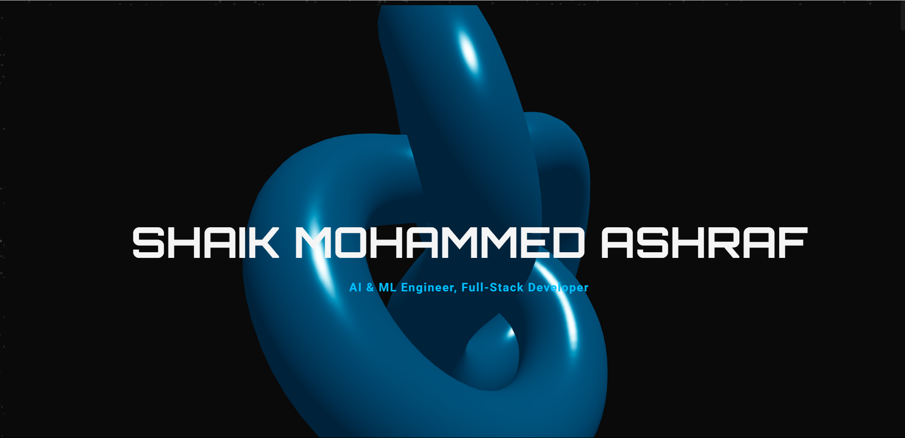

# Shaik Mohammed Ashraf - 3D Animated Portfolio

  

<h2 align="center">
  <a href="https://s-md-ashraf-portfolio.vercel.app/" target="_blank">🚀 View Live Demo 🚀</a>
</h2>

  This repository contains the source code for my personal portfolio, a fully interactive, 3D-animated digital experience designed to showcase my skills as an AI & ML Engineer and Full-Stack Developer.

---

## ✨ About The Project

This isn't just a portfolio; it's a digital statement. The goal was to move beyond static pages and create an immersive, memorable experience that reflects my passion for cutting-edge technology and elegant design. The entire site is a single-page application built with a modern, high-performance tech stack, featuring complex 3D visuals, fluid scroll-driven animations, and a fully responsive layout.

Every section, from the "Neural Journey" of my education to the showcase of my projects, was meticulously crafted to tell a story and demonstrate technical proficiency.

### Key Features:

*   **Interactive 3D Hero Section:** A stunning, mouse-reactive model rendered with React Three Fiber.
*   **Scroll-Driven Animations:** The entire site is animated on scroll using GSAP for a fluid, narrative-driven experience.
*   **"Neural Journey" Timeline:** A unique, custom-built SVG timeline that animates to visualize my academic and professional path.
*   **Dynamic Component-Based Architecture:** Built with reusable React components for maintainability and scalability.
*   **Fully Responsive Design:** A flawless viewing experience on all devices, from mobile phones to 4K desktops.
*   **Performance Optimized:** Built with Next.js for Static Site Generation (SSG), ensuring lightning-fast load times.

## 🏛️ Architectural Philosophy & Core Technologies

This portfolio is not just a collection of components; it's a fully-integrated digital ecosystem built on a philosophy of performance, elegance, and interactivity. The technology stack was chosen to serve this vision.

*   **Core Framework & Performance:** The application is built on **Next.js** and the **React** ecosystem. We leverage **Static Site Generation (SSG)** to serve pre-rendered, hyper-optimized HTML, resulting in near-instantaneous load times and a world-class user experience.

*   **The 3D Visual Engine:** The immersive visuals are powered by **React Three Fiber (R3F)** and **Drei**. This declarative approach allows for the creation of complex, performant 3D scenes directly within the React paradigm, turning the browser into a canvas for digital art.

*   **Cinematic Animation:** All motion, from the subtle micro-interactions to the grand, scroll-driven "Neural Journey," is orchestrated by the **GreenSock Animation Platform (GSAP)**. Its powerful `ScrollTrigger` plugin is the engine behind the site's narrative flow.

*   **Styling & Encapsulation:** The visual identity is managed by **Styled-Components**. This CSS-in-JS methodology ensures that every component is a self-contained, stylistically-independent module, leading to a highly maintainable and scalable codebase.

*   **Deployment & Delivery:** The entire project is deployed on **Vercel's** global edge network, with seamless CI/CD integrated directly with the GitHub repository, ensuring that every push is automatically built, optimized, and delivered with maximum speed and reliability.

## 💡 A Note on the Source Code

This repository is available for exploration and inspiration. The code is a testament to modern front-end practices, demonstrating a clean, component-based architecture and a strong emphasis on both aesthetic quality and technical performance. Feel free to explore how different sections were constructed.

## 📬 Contact

Shaik Mohammed Ashraf - [LinkedIn](https://linkedin.com/in/ashrafshaikmohammed) - smdashraf01@gmail.com

Project Link: [https://github.com/Ashraf0705/my-portfolio](https://github.com/Ashraf0705/my-portfolio)
